[TOC]


<!-- 

[![download][mdversion-button]][md-pypi]

[mdversion-button]: downlaod
[md-pypi]: https://pypi.org/project/Markdown/ -->

# USB Simulator


The idea aims to reduice the amount of work for USB sticks plug in & out during the testing. Raspberry Pi Zero can emulate USB devices (MSC, HID, Eth Adapter, etc). The tool can also automate tests via SSH communication. The PID/VID of the emulated USB devices can be easily adjusted as well.

## Big Picture

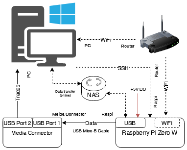

## Prerequisites

| Hardware                   | Software                                                       |
| -------------              | -------------                                                  |
| RaspberryPi zero W         | [Raspberry Pi Imanger (download)](https://www.raspberrypi.com/software/)  |
| USB Mico-B Cable (OTG)     | [The latest released USBTool](https://github.com/luxc1101/raspi-usb-sim/releases) |
| USB Mico-B Cable (Power)   |                                                                |
| micoSD Card (e.g. 128 GB)  |                                                                |
| micoSD Card Reader         |                                                                |
| WiFi with known SSID and Password (router or 2.4 GHz Mobile Hotspot)             |                                                                |
| USB WiFi adapter |                                                                |

> **NOTE**:  
> if the PC is unable to receive WiFi, then USB WiFi adapter is needed, once USB WiFi adapter is plunged in, to connect WiFi through adapter should be available

## Quick Tutorial

### Operation System Installation

#### SD card format

- right click → format as FAT32
- or in Raspberry Pi Imager → OS wählen → löschen (card as FAT32 format)

#### [Rpi Imager (download)](https://www.raspberrypi.com/software/)

- Raspberry Pi Modell: Raspberry Pi Zero
- Select OS: 
  - `Raspberry Pi OS (Legacy, 32-bit) Lite` (**bullseye**) (old rpi os)
  - `Raspberry Pi OS (Legacy, 32-bit) Lite` (**bookworm**) (recommand)
  - `Raspberry Pi OS (32-bit) Lite` (**Trixie**) (latest OS, ssh connection somehow slow)
- Choose SD card
- Setting option
  - Hostname: rpi<?>.local # e.g. rpi0.local
  - Username: pi
  - pw: pass
  - WiFi:
    - SSID: <WiFi network name (ssid)>
    - PW: <password of ssid>
    - country: DE
  - Timezone: Europe/Berlin
  - Keyboard layout: de
  - SSH activate

### Download USBTool Software

find the latest released version from [Releases · Raspi-USB-Simulator · Github](https://github.com/luxc1101/raspi-usb-sim/releases), click packages usbtool-vx.x.x to download.

unzip the downloaded packages, the downloaded release folder structure:
<details>
  <summary>folder structure (./usb-tool_vx.x.x/dist/)</summary>
  
  ```
  .
  |   Config.json
  |   device_proj.json
  |   USBSimulator.exe
  |
  +---usbtool_install
  |   |   device_proj.json
  |   |   fswd.service
  |   |   fswd.sh
  |   |   install.sh
  |   |   kybd-descriptor.bin
  |   |   mount_app.py
  |   |   mount_robot.py
  |   |   requirements.txt
  |   |
  |   \---src
  |           acm_device.py
  |           a_device.py
  |           a_validator.py
  |           device_data.py
  |           device_dictcreator.py
  |           ecm_device.py
  |           fscreator.py
  |           hid_device.py
  |           msc_device.py
  |           rndis_device.py
  |           samba_service.py
  |           usb_peripheral.py
  |           watchdog_service.py
  |
  \---wificonfig
          ssh
          wpa_supplicant.conf
  ```

</details>

### Connections

Before starting, it is important to know that the Raspberry Pi and the test PC need to be on the same wireless network. Therefore, you must first secure that PC is able to connect to the desired 2.4 GHz WiFi network wirelessly.

#### Preparing the Rpi: Editing the WiFi Configuration File
>
> **NOTE**:  
>Once you have already configured the WiFi SSID and PSK in step [Operation System Installation](#operation-system-installation) and the WiFi is not changed (SSID, PSK) and still available, you can skip this step.

<details>
  <summary>Change WiFi for old rpi OS e.g. bullseye</summary>
  Only if WiFi network was changed, `ssh` (without file typ) and `wpa_supplicant.conf` (with new WiFi ssid and password) should write into bootfs partition of SD card.

  <details>
    <summary>wpa_supplicant.conf</summary>
  
    # Datei wpa_supplicant.conf in der Boot-Partition (Raspbian Stretch)
    country=DE
    update_config=1
    ctrl_interface=DIR=/var/run/wpa_supplicant GROUP=netdev
    network={
     key_mgmt=WPA-PSK
     ssid="<SSID>>"
     psk="<password>"
    }

  </details>
</details>

<details>
  <summary>Change WiFi for new rpi OS e.g. bookworm/trixie</summary>
  
  scan availabel wifi list

  ```shell
  sudo iwlist scan | grep "<SSID>"
  ```
  list availbale WiFi metworks
  
  ```shell
  nmcli dev wifi list
  ```
  Connect to new WiFi
  
  ```shell
  sudo nmcli dev wifi connect "YourWiFiName" password "YourPassword"
  ```
</details>
  
#### Preparing the Rpi: Mounting and Connections

Once the microSD card has been updated, remove it from the microSD card reader and mount it on the Rpi.

Then plugin USB Micro-B cable (Power) and USB Micro-B cable (OTG). Now, the tester is instructed to make the following connections.

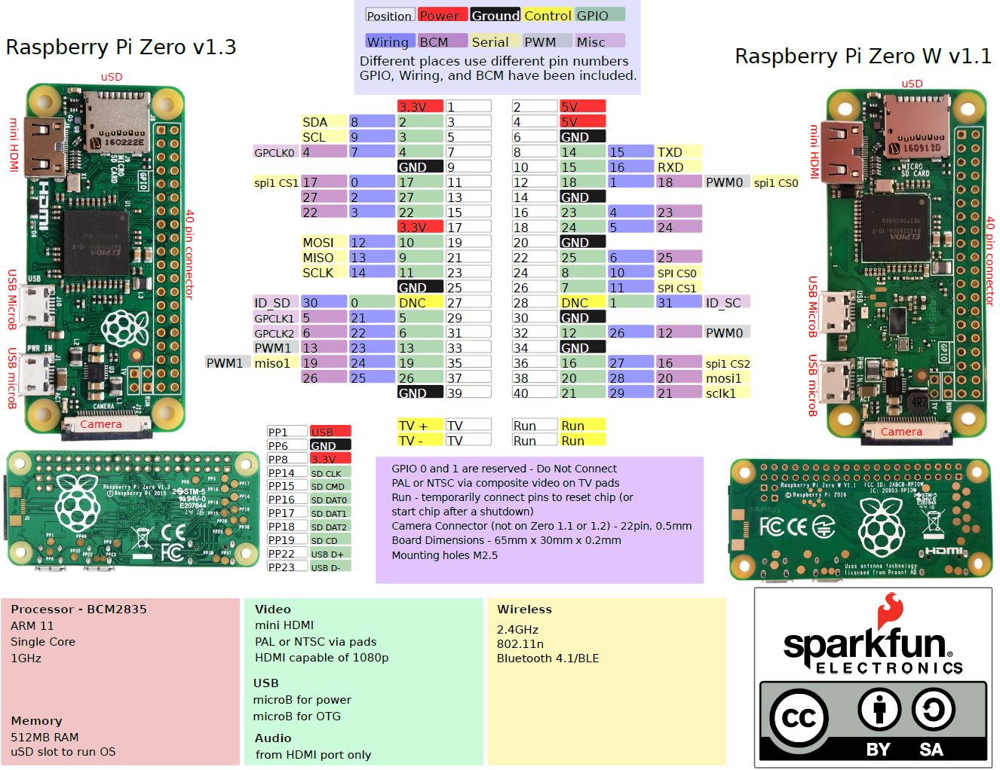
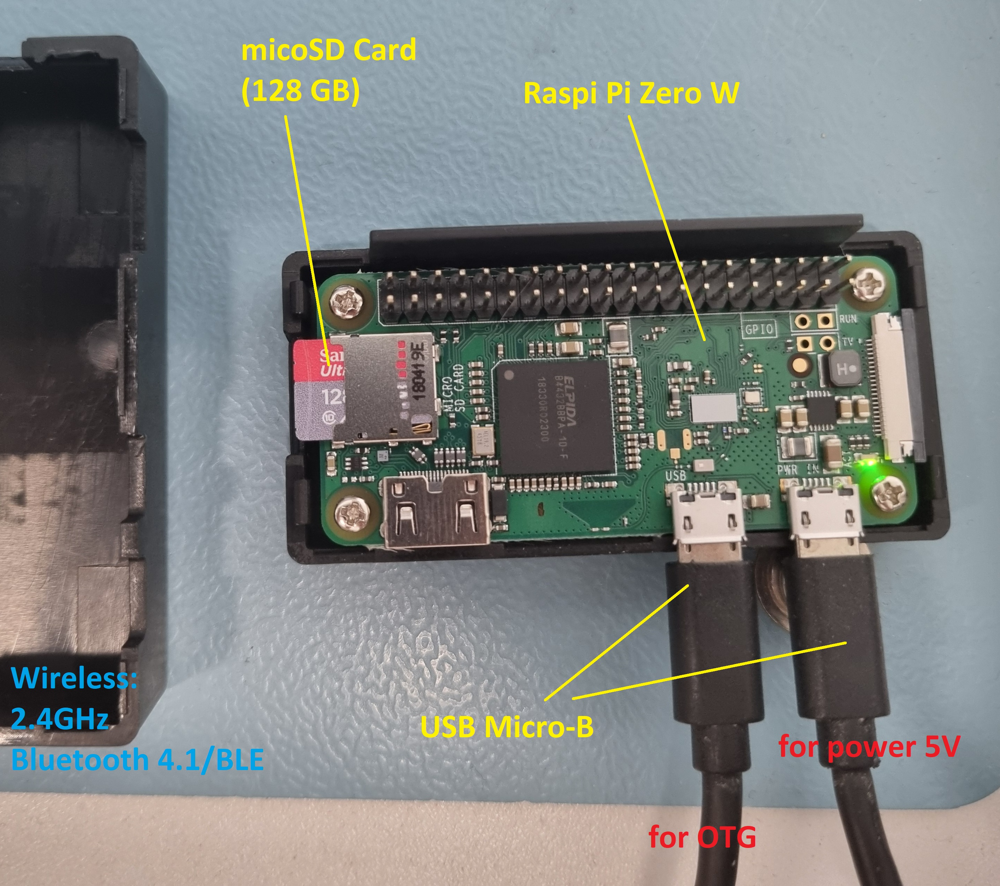

#### Preparing the SSH Connection: IP, Port, SSID and Password
>
> **NOTE**:  
>it could take few mins at FIRST time until Rpi connected to the WiFi.

WiFi sources may be different, such as routers, hotspots, etc. Raspberry IP address could be check in different ways:

##### Router
>
> **Hint**:  
> if WiFi network was changed, ssh (without file typ) and wpa_supplicant.conf (with new WiFi ssid and password) should be firstly written into bootfs partition of micoSD card.
<details>

- solution 1 (recommend)
  - connect local machine to WiFi via USB WiFi adapter, e.g. WiFi SSID: `AMB-StreamWLAN`, PW: *********
  - typing router ip address http://xxx.xxx.xxx.xxx/ on browser, check IP-Address of the conencted device with name e.g. `raspberrypi`

      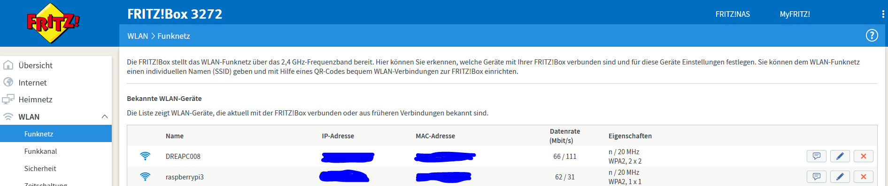

- solution 2
  - Using Putty to connect to Rpi to allow access to the Rpi via ssh and save login info as session
    - Hostname: e.g. `raspberrypi.local`→[enter]
    - Login as: `pi`
    - PW: `raspberry`

        ```bash
        hostname -I # 192.168.188.xx
        ```

- solution 3
  - open a terminal

      ```powershell
      ping <Hostname> # ping raspberrypi.local
      ```

      expected output

      ```
      Ping wird ausgeführt für raspberrypi.local [192.168.188.38] mit 32 Bytes Daten:
      Antwort von 192.168.188.38: Bytes=32 Zeit=22ms TTL=64
      ...
      ```
</details>

##### Mobile Hotspot
>
> **Hint**:  
> if WiFi network was changed, ssh (without file typ) and wpa_supplicant.conf (with new WiFi ssid and password) should firstly be written into bootfs partition of micoSD card.
<details>

- activate Hotspot with Band **2.4 GHz** through mobile hotspot device (e.g. Samsung Galaxy S21)
- make sure that PC and Rpi device is connected to Android Phone Hotspot
  
    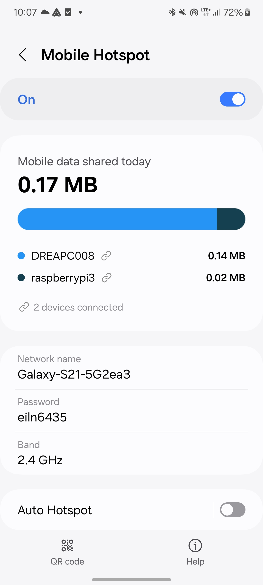
- check rapberry pi device IP address from Android Phone

    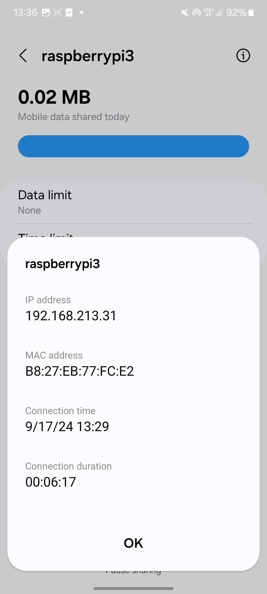

once WiFi connection in Rpi is establish, connect PC to the same WiFi, and go ping Rpi device is to find out if a device is reachable at a particular IP address:

open a terminal (PC or VM)

```powershell
ping <raspi ip address> 
```

expected output

```Confluence
Ping wird ausgeführt für 192.168.209.31 mit 32 Bytes Daten:
Antwort von 192.168.209.31: Bytes=32 Zeit=241ms TTL=64
Antwort von 192.168.209.31: Bytes=32 Zeit=12ms TTL=64
...
```
</details>

### SSHClient Creation

With the GUI `USBSimulator.exe` launched, click on the `SSH Connect` button and new menu (Raspi SSH Connection) will pop up asking you for details such as IP Address, Port Number, Username, and SSID, etc., as shown below:

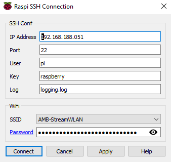

Now input the IP address in the SSH connect sub menu, select the SSID and  input its corresponding password and hit Connect.

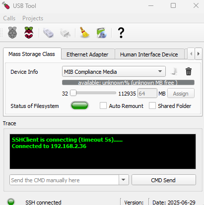

Now a SSHClient is via USB Tool created, you can try to type and sent command through command line editor, e.g. pwd, it should work.

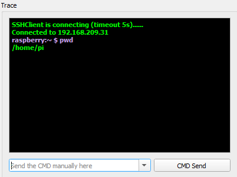

### Configuration

#### Preparing package installation and configuration for Rpi

click button `Install USB Gadget`, installation dialog will pop up, select folder `./usbtool_install` from browser

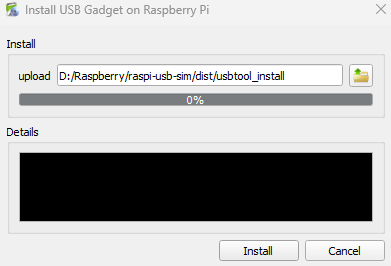

click button `install`, start the installation and wait until the progress is complete

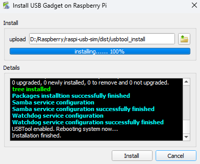

If no errors occur during the installation process, the Rpi device will automatically reboot.
<details>

  ```
  apt-get update and upgrade
  Get:1 http://raspbian.raspberrypi.org/raspbian bullseye InRelease [15.0 kB]
  Get:2 http://archive.raspberrypi.org/debian bullseye InRelease [39.0 kB]
  Get:3 http://raspbian.raspberrypi.org/raspbian bullseye/main armhf Packages [13.2 MB]
  Get:4 http://archive.raspberrypi.org/debian bullseye/main armhf Packages [327 kB]
  Fetched 13.6 MB in 25s (542 kB/s)
  Reading package lists...
  Reading package lists...
  Building dependency tree...
  Reading state information...
  ...
  USBTool enabled. Rebooting system now...
  ```
</details>

### GUI and Elements

<details>

UI Design Elements:

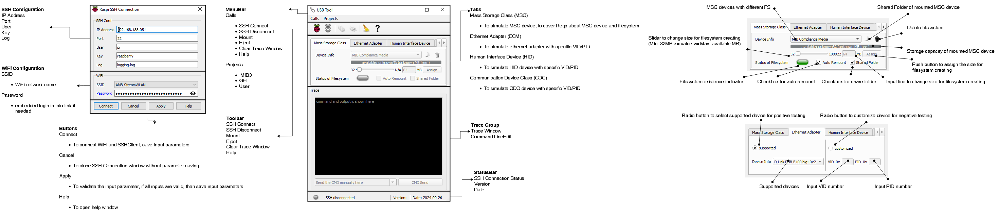

State Machine:

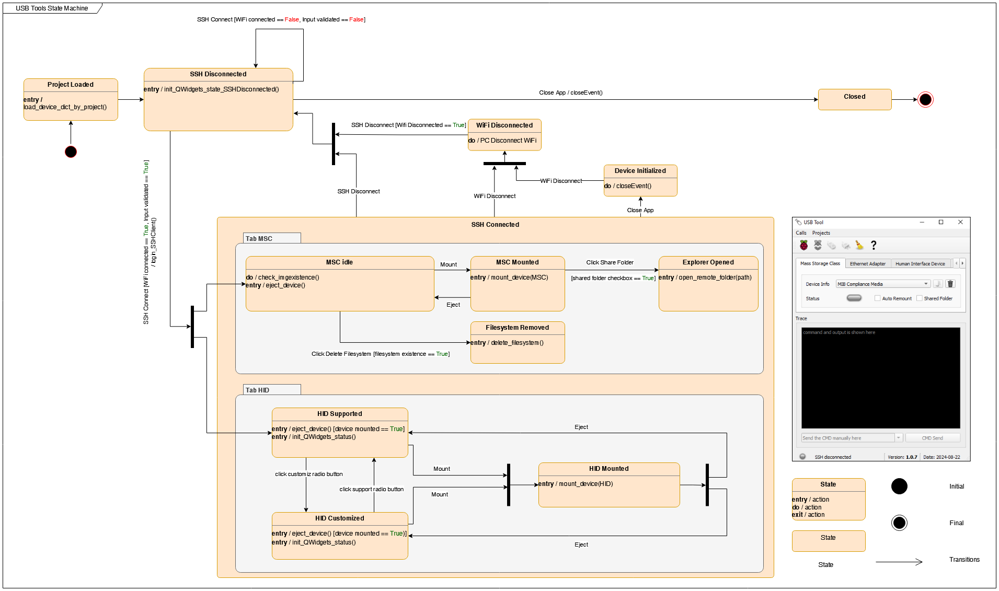

#### Menubar

- **Calls**
  - **SSH Connect**: connect WiFi and build SSHClient connection with correct login parameters
  - **SSH Disconnect**: disconnect SSHClient
  - **Mount**: mount device.
  - **Eject**: eject device.
  <!-- - **Remote Folder**: open remote folder (NAS) of mounted filesystem only if samba service is enable. It will provide a possibility to modify the files in remote folder. The modifications will also be synchronised at the raspi mount point. -->
  - **Clear**: clear the trace window up.
  - **Install USB Gadget**: USB tool installation and configuration for Rpi
  <!-- - **Delete**: delete filesystem image. -->
  - **Help**: quick user guaid.
- **Project**
  - MIB3 (Done)
  - GEI (Progressing)
  - User (Progressing)
  
#### Device Tab

- **Mass Storage Class (MSC)**: mount MSC device with different filesystems, it is able to create and delete filesystem and open its shared folder
- **Ethernet Adapter (ECM)**: mount ECM devices with specific VID and PID
- **Human Interface Device (HID)**: mount HID devices with specific VID and PID
- **Communication Device Class (CDC)**: mount CDC devices with specific VID and PID
- **Network Control Model (NCM)**: mount NCM devices with specific VID and PID
- **Media Transfer Protocal (MTP)**: mount MTP devices with specific VID and PID

#### Trace

- **Trace Window**: (read only) shows commands and the standard output and error, in case standard input as well
- **Command LineEdit**: send command to remote Rpi device via SSHClient

#### Statusbar

- QLed will indicate the SSHClient connection state. <span style="color:lime">Green</span>: SSH Connected <span style="color:gray">Gray</span>: SSH Disconnected

</details>

## Checklist

- [x] WiFi with known SSID and Passport
- [x] microSD card within correct OS, needed scripts and installed packages
- [x] Rpi, USB micro-B to USB A Cabel x2, USB WiFi adapter (if needed)
- [x] `wpa_supplicant.conf` and `ssh` are written into bootfs partition in microSD card, ONLY if WiFi has to be changed. (e.g. ssid="AMB-StreamWLAN")
- [x] power Rpi up and connect Rpi to DUT, USB WiFi adapter is connected to PC (if needed)
- [x] WiFi & SSH connection is establish
- [x] `Config.json`, `device_proj.json` and `USBSimulator.exe` should be in **SAME** folder or root path

## USBTool in Robot Testframework

The USBTool can also be implemented in Robot Testframework for testautomation. The [SSHLibrary](https://marketsquare.github.io/SSHLibrary/SSHLibrary.html) will enable to cotrol the USBTool through SSHClient.

### Prerequisites

- functional HADES
- functional USBTool
- fully intergreated DUT

### Libraries

- [SSHLibrary](https://marketsquare.github.io/SSHLibrary/SSHLibrary.html)
- [Process](https://robotframework.org/robotframework/latest/libraries/Process.html)
  
### Variables

  ```robotframework
  ${USBTOOL_CONFIG}    testcases/resources/usbtool_config.json
  ```

<details>
  <summary>Click to expand Config.json</summary>

  ```json
    {
      "SSHConf": {
        "_comment": "how to find IPAddress please go README.md",
        "User": "pi",
        "IPAddress": "000.000.000.000",
        "Key": "raspberry",
      },
      "WiFi": {
        "_comment": "ssid and password",
        "ssid": "<ssid>",
        "psk": "<password>"
      }
    }
  ```

</details>

### Keywords

  resource: [example.robot](https://github.com/luxc1101/raspi-usb-sim/blob/master/testcases/resource/example.robot)
  
  ```robotframework
  Connect SSH To Raspi USB SIM
  Reboot Raspi
  Reboot Raspi And Reconnect
  Mount Filesystem Raspi      ${Fs}
  Remount Filesystem Raspi    ${Fs}
  Unmount USB Device Raspi
  Mount USB Device Raspi      ${DeviceType}    ${DeviceVID}    ${DevicePID}
  ```

## Troubleshooting
- Unclean file system
  - if NTFS file system is removed from windows system but without safely removing before, then at next time after mounting the same NTFS filesystem those warnings will be shown on trace usbtool trace window.
    ```text
    WARN: The disk contains an unclean file system (0, 0).
    WARN: The file system wasn't safely closed on Windows. Fixing.
    ```

- Shared folder will not be able to access xxx.xxx.xxx.xxx
  - [AllowInsecureGuestAuth | Microsoft Learn](https://learn.microsoft.com/de-de/windows-hardware/customize/desktop/unattend/microsoft-windows-workstationservice-allowinsecureguestauth)

    | Value           | Info           |
    | -------------   | -------------  |
    | 0 | SMB client rejects insecure guest logons.This is the default, and recommended value |
    | 1 | SMB client allows insecure guest logons. |
  - win + R → regedit → HKEY_LOCAL_MACHINE\SYSTEM\CurrentControlSet\Services\LanmanWorkstation\Parameters
    
    "AllowInsecureGuestAuth"=dword:00000001
    
    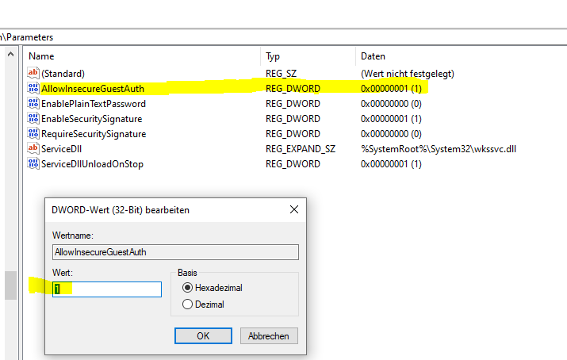
  
  - If there is no AllowInsecureGuestAuth file, please create AllowInsecureGuestAuth and assign value as a DWORD

- [BUG: Wi-Fi config via Raspberry Pi Imager failed](https://github.com/raspberrypi/rpi-imager/issues/1067) 
  - resolved in Raspberry Pi Imager version 1.9.5
